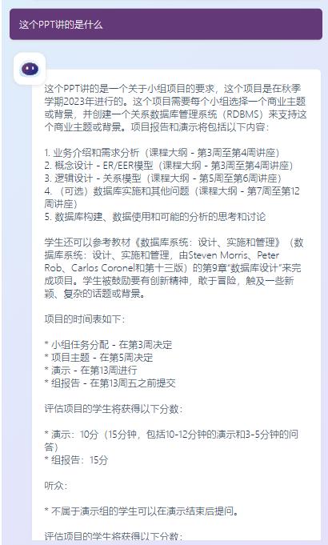
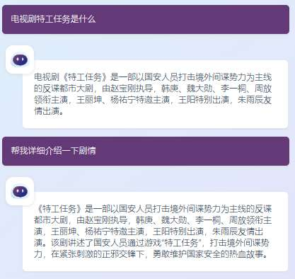

# LenoMate

LenoMate是一款智能桌面助手，作为电脑的中枢，可以帮助用户操作电脑或者进行聊天类功能

底层大语言模型是一款基于chatglm2/qwen进行微调（目前因微调效果更好已切换至qwen，训练详见qwen训练），

聊天类功能为日常聊天，网页搜索问答，PPT总结以及讲稿，PDF总结

操作类功能目前支持屏幕亮度调节，音量调节，备忘录，打开软件，电脑配置查询，壁纸生成，蓝屏分析

## 文件分析

## 网络搜索

## 壁纸生成

# 新功能添加操作

1. 定义好新功能的py文件，并且调试通过
2. 如果有新增prompt，将对应prompt加入到prompt文件中
3. 在chat_mode.py文件中导入新功能（分模型），如果为文字类放在chat_bot下,如果是操作类放在opr_bot下
4. chat bot如果需要流式输出使用stream_chat，并且回传时直接回传迭代器然后流式与客户端通信，如果只需要中间过程（如生成image prompt）泽使用chat

# 操作任务更新操作(Operation_bot 增加新操作)

每次加入新的操作类任务(data/document_corpus)，需更新操作库的embedding, 命令行运行 python utils/renew_corpus.py

# windows的bitsandbytes使用如下仓库

https://github.com/jllllll/bitsandbytes-windows-webui

pyinstaller -D "chat_server copy.py"
