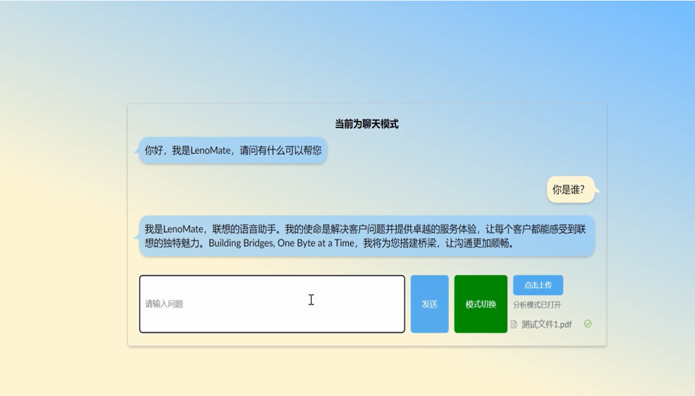
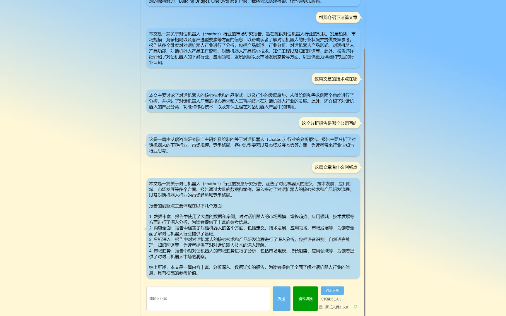
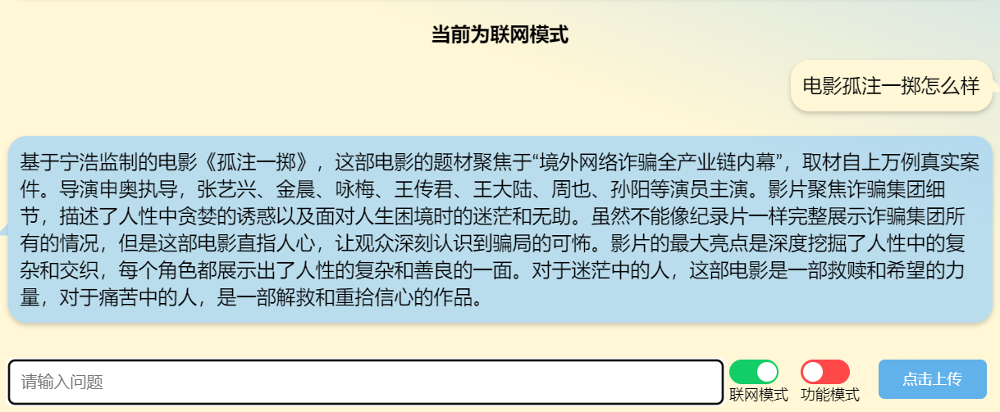

# LenoMate

LenoMate是一款智能桌面助手，可以帮助用户操作电脑或者进行聊天类功能

底层大语言模型是一款基于chatglm2进行微调，

聊天类功能为日常聊天，网页搜索问答，PPT总结以及讲稿，PDF总结

操作类功能目前支持屏幕亮度调节，音量调节，备忘录，打开软件，电脑配置查询

## 文件分析

## 网络搜索

# 操作指令更新操作

每次加入新的指令(data/document_corpus)，需更新操作库的embedding, 命令行运行 python utils/renew_corpus.py

# windows的bitsandbytes使用如下仓库

https://github.com/jllllll/bitsandbytes-windows-webui
